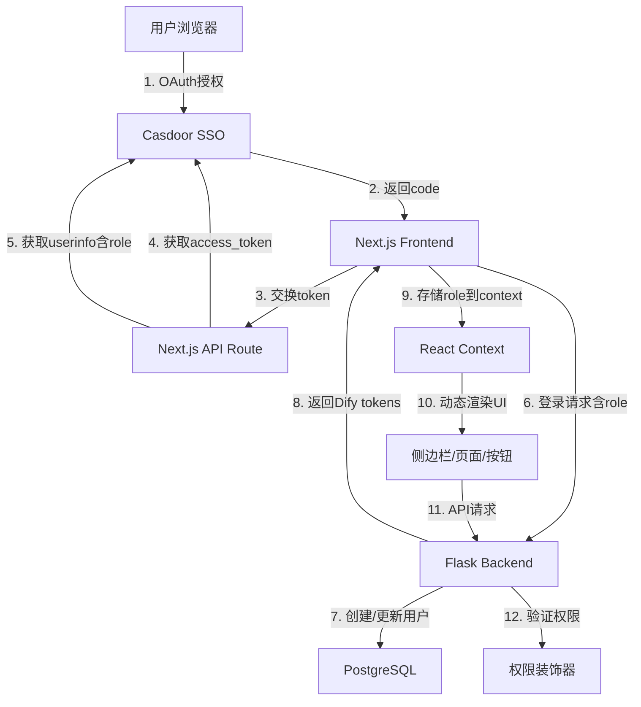
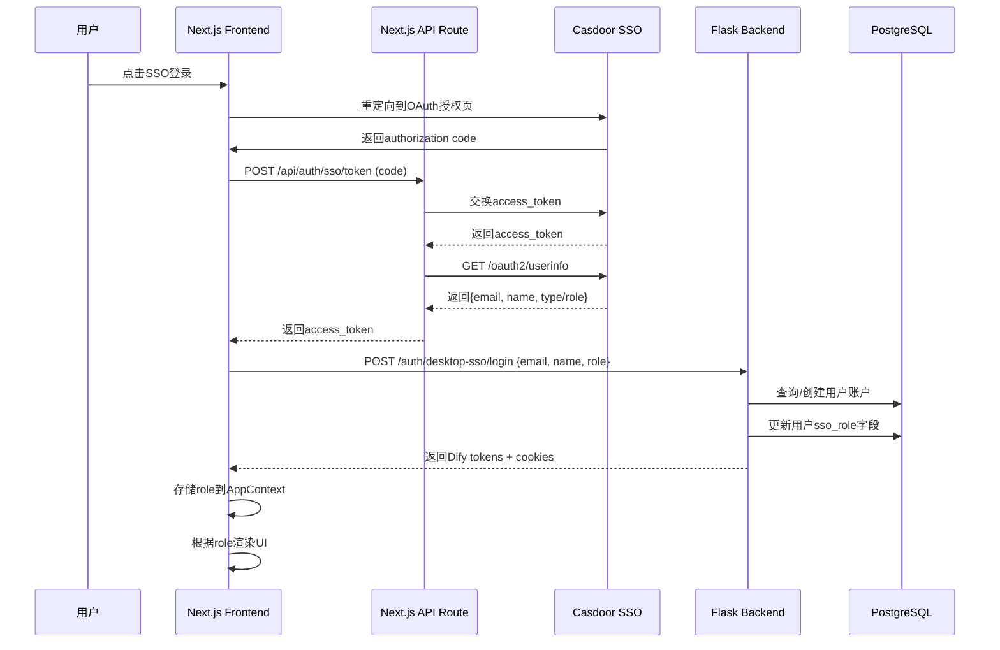

# 设计文档：SSO 角色权限控制系统

## 概述

本设计实现基于 SSO（Single Sign-On）的三级角色权限控制系统，用于在 CheersAI 平台中动态控制用户的功能访问权限和界面可见性。系统从 Casdoor SSO 获取用户角色信息（admin/technician/user），并在前后端实现完整的权限控制机制。

**三个角色的权限**：
- **管理员（admin/owner）**: 8个菜单 - 所有功能（包括审计日志）
- **技术员（technician/editor）**: 7个菜单 - 无审计日志
- **普通用户（user/normal）**: 5个菜单 - 我的Agent、对话、知识库（只读）、应用中心（只读）、探索

**技术栈**：
- 后端：Python Flask
- 前端：Next.js + TypeScript + React
- SSO：Casdoor OAuth2

## 架构设计



## 主要工作流程



## 组件和接口

### 组件 1：SSO 角色提取器（Backend）

**目的**：从 Casdoor SSO 的 userinfo 中提取角色信息，并映射到系统角色

**接口**：
```python
# api/controllers/console/auth/sso_token.py

class SSOTokenExchangeApi(Resource):
    def post(self) -> dict:
        """
        交换 SSO authorization code 为 access token，
        获取用户信息（包括角色），创建/更新用户账户
        
        Returns:
            {
                'result': 'success',
                'access_token': str,
                'refresh_token': str
            }
        """
        pass

def extract_role_from_userinfo(user_info: dict) -> str:
    """
    从 SSO userinfo 中提取角色字段
    
    Args:
        user_info: SSO返回的用户信息字典
        
    Returns:
        系统角色: 'admin', 'editor', 或 'normal'
    """
    pass

def map_sso_role_to_system_role(sso_role: str) -> str:
    """
    映射 Casdoor 角色到系统角色
    
    Mapping:
        'admin', 'owner' -> 'admin'
        'technician', 'editor' -> 'editor'
        'user', 'normal', None -> 'normal'
    
    Args:
        sso_role: Casdoor 的 type 字段值
        
    Returns:
        系统角色: 'admin', 'editor', 或 'normal'
    """
    pass
```

**职责**：
- 与 Casdoor SSO 通信获取 access_token
- 调用 userinfo 端点获取用户信息（包括 type/role 字段）
- 将 Casdoor 角色映射到系统角色（admin/editor/normal）
- 创建或更新用户账户，存储角色信息


### 组件 2：用户账户服务（Backend）

**目的**：管理用户账户的创建、更新和角色存储

**接口**：
```python
# api/services/account_service.py

class AccountService:
    @staticmethod
    def get_or_create_sso_account(
        email: str,
        name: str,
        sso_role: str
    ) -> Account:
        """
        获取或创建 SSO 用户账户，并更新角色
        
        Args:
            email: 用户邮箱
            name: 用户名称
            sso_role: 系统角色 ('admin', 'editor', 'normal')
            
        Returns:
            Account 对象
        """
        pass
    
    @staticmethod
    def update_account_role(account: Account, sso_role: str) -> None:
        """
        更新用户账户的 SSO 角色
        
        Args:
            account: Account 对象
            sso_role: 新的系统角色
        """
        pass
```

**职责**：
- 根据邮箱查询现有用户
- 创建新用户账户（如果不存在）
- 更新用户的 sso_role 字段
- 激活账户状态

### 组件 3：工作空间角色同步器（Backend）

**目的**：将 SSO 角色同步到用户的工作空间成员角色

**接口**：
```python
# api/services/workspace_service.py

class WorkspaceService:
    @staticmethod
    def sync_workspace_role_from_sso(
        account: Account,
        sso_role: str
    ) -> None:
        """
        将 SSO 角色同步到用户的默认工作空间
        
        Args:
            account: Account 对象
            sso_role: 系统角色 ('admin', 'editor', 'normal')
        """
        pass
    
    @staticmethod
    def map_sso_role_to_workspace_role(sso_role: str) -> str:
        """
        映射系统角色到工作空间角色
        
        Mapping:
            'admin' -> 'owner'
            'editor' -> 'editor'
            'normal' -> 'normal'
        
        Args:
            sso_role: 系统角色
            
        Returns:
            工作空间角色
        """
        pass
```

**职责**：
- 查找用户的默认工作空间
- 更新工作空间成员的角色字段
- 确保角色映射的一致性


### 组件 4：权限验证装饰器（Backend）

**目的**：在 API 端点上验证用户权限

**接口**：
```python
# api/libs/permission_decorators.py

def require_role(*allowed_roles: str):
    """
    装饰器：验证用户是否具有指定角色之一
    
    Args:
        allowed_roles: 允许的角色列表，如 'admin', 'editor', 'normal'
        
    Usage:
        @require_role('admin')
        def admin_only_endpoint():
            pass
        
        @require_role('admin', 'editor')
        def editor_and_above_endpoint():
            pass
    """
    pass

def require_admin(func):
    """装饰器：仅管理员可访问"""
    pass

def require_editor_or_above(func):
    """装饰器：技术员及以上可访问"""
    pass
```

**职责**：
- 从请求上下文中获取当前用户
- 检查用户的工作空间角色
- 拒绝无权限的请求（返回 403）
- 记录权限检查失败的尝试

### 组件 5：前端 SSO 服务（Frontend）

**目的**：处理 SSO 登录流程，获取并传递角色信息

**接口**：
```typescript
// web/service/sso.ts

export interface ExchangeTokenParams {
  code: string
  state: string
  redirectUri: string
}

export interface SSOUserInfo {
  id: string
  email: string
  name: string
  role?: string
  type?: string
}

export const exchangeSSOToken = async (
  params: ExchangeTokenParams
): Promise<{ result: string }> => {
  // 1. 交换 OAuth code 为 SSO access_token
  // 2. 获取 userinfo（包括 role/type）
  // 3. 调用后端登录接口，传递 role
  // 4. 返回登录结果
}

export const getSSOUserInfo = async (): Promise<SSOUserInfo> => {
  // 从 SSO 获取用户信息
}
```

**职责**：
- 调用 Next.js API Route 交换 token
- 获取 SSO userinfo（包括角色）
- 将角色信息传递给后端登录接口
- 处理错误和异常情况


### 组件 6：应用上下文提供者（Frontend）

**目的**：管理全局应用状态，包括用户角色信息

**接口**：
```typescript
// web/context/app-context.tsx

export type AppContextValue = {
  userProfile: UserProfileResponse
  currentWorkspace: ICurrentWorkspace
  isCurrentWorkspaceManager: boolean  // admin
  isCurrentWorkspaceOwner: boolean    // owner
  isCurrentWorkspaceEditor: boolean   // admin or editor
  isCurrentWorkspaceDatasetOperator: boolean
  mutateUserProfile: VoidFunction
  mutateCurrentWorkspace: VoidFunction
  // ... 其他字段
}

export interface ICurrentWorkspace {
  id: string
  name: string
  role: 'owner' | 'admin' | 'editor' | 'normal' | 'dataset_operator'
  // ... 其他字段
}

export const useAppContext = () => useContext(AppContext)
```

**职责**：
- 从后端 API 获取当前工作空间信息（包括 role）
- 提供角色判断的便捷方法（isAdmin, isEditor 等）
- 在整个应用中共享用户和角色信息
- 支持角色信息的刷新和更新

### 组件 7：侧边栏导航（Frontend）

**目的**：根据用户角色动态渲染菜单项

**接口**：
```typescript
// web/app/components/header/side-nav/index.tsx

interface NavItemConfig {
  id: string
  href: string
  icon: React.ReactNode
  activeIcon: React.ReactNode
  label: string
  segments: string[]
  requiredRole?: 'admin' | 'editor' | 'normal'
}

const SideNav: React.FC = () => {
  const { currentWorkspace } = useAppContext()
  
  // 根据角色过滤菜单项
  const visibleNavItems = useMemo(() => {
    return filterNavItemsByRole(allNavItems, currentWorkspace.role)
  }, [currentWorkspace.role])
  
  return (
    <nav>
      {visibleNavItems.map(item => (
        <NavItem key={item.id} {...item} />
      ))}
    </nav>
  )
}
```

**职责**：
- 根据 currentWorkspace.role 动态生成菜单列表
- 隐藏用户无权访问的菜单项
- 处理菜单的展开/收起状态
- 高亮当前活动的菜单项


### 组件 8：权限控制 Hook（Frontend）

**目的**：提供可复用的权限判断逻辑

**接口**：
```typescript
// web/hooks/use-permission.ts

export const usePermission = () => {
  const { currentWorkspace } = useAppContext()
  
  return {
    isAdmin: ['owner', 'admin'].includes(currentWorkspace.role),
    isEditor: ['owner', 'admin', 'editor'].includes(currentWorkspace.role),
    isNormal: true,
    
    canCreateAgent: ['owner', 'admin', 'editor'].includes(currentWorkspace.role),
    canEditAgent: ['owner', 'admin', 'editor'].includes(currentWorkspace.role),
    canDeleteAgent: ['owner', 'admin', 'editor'].includes(currentWorkspace.role),
    
    canCreateDataset: ['owner', 'admin', 'editor'].includes(currentWorkspace.role),
    canEditDataset: ['owner', 'admin', 'editor'].includes(currentWorkspace.role),
    
    canViewAuditLogs: ['owner', 'admin'].includes(currentWorkspace.role),
    
    hasRole: (role: string) => currentWorkspace.role === role,
    hasAnyRole: (...roles: string[]) => roles.includes(currentWorkspace.role),
  }
}

export const useRequireRole = (requiredRole: string | string[]) => {
  const { currentWorkspace } = useAppContext()
  const router = useRouter()
  
  useEffect(() => {
    const roles = Array.isArray(requiredRole) ? requiredRole : [requiredRole]
    if (!roles.includes(currentWorkspace.role)) {
      router.push('/403')
    }
  }, [currentWorkspace.role, requiredRole, router])
}
```

**职责**：
- 提供统一的权限判断接口
- 封装角色检查逻辑
- 支持页面级权限保护
- 提供细粒度的功能权限判断

## 数据模型

### 模型 1：Account（用户账户）

```python
# api/models/account.py

class Account(db.Model):
    __tablename__ = 'accounts'
    
    id: str = db.Column(UUID, primary_key=True)
    email: str = db.Column(db.String(255), nullable=False, unique=True)
    name: str = db.Column(db.String(255), nullable=False)
    password_hash: Optional[str] = db.Column(db.String(255))
    status: str = db.Column(db.String(16), default='active')
    
    # 新增字段：存储 SSO 角色
    sso_role: Optional[str] = db.Column(
        db.String(16), 
        nullable=True,
        comment='SSO role: admin, editor, normal'
    )
    
    # 新增字段：标记是否为 SSO 用户
    is_sso_user: bool = db.Column(
        db.Boolean, 
        default=False,
        comment='Whether user logged in via SSO'
    )
    
    created_at: datetime = db.Column(db.DateTime, default=naive_utc_now)
    updated_at: datetime = db.Column(db.DateTime, onupdate=naive_utc_now)
```

**验证规则**：
- email 必须唯一且格式有效
- sso_role 只能是 'admin', 'editor', 'normal' 或 NULL
- SSO 用户的 password_hash 可以为空


### 模型 2：TenantAccountJoin（工作空间成员）

```python
# api/models/account.py

class TenantAccountJoin(db.Model):
    __tablename__ = 'tenant_account_joins'
    
    id: str = db.Column(UUID, primary_key=True)
    tenant_id: str = db.Column(UUID, nullable=False)
    account_id: str = db.Column(UUID, nullable=False)
    
    # 工作空间角色
    role: str = db.Column(
        db.String(16), 
        nullable=False, 
        default='normal',
        comment='Workspace role: owner, admin, editor, normal, dataset_operator'
    )
    
    created_at: datetime = db.Column(db.DateTime, default=naive_utc_now)
    updated_at: datetime = db.Column(db.DateTime, onupdate=naive_utc_now)
```

**验证规则**：
- role 必须是有效的工作空间角色值
- 每个工作空间至少有一个 owner
- tenant_id + account_id 组合唯一

### 模型 3：ICurrentWorkspace（前端类型）

```typescript
// web/models/common.ts

export interface ICurrentWorkspace {
  id: string
  name: string
  plan: string
  status: string
  created_at: number
  
  // 用户在此工作空间的角色
  role: 'owner' | 'admin' | 'editor' | 'normal' | 'dataset_operator'
  
  providers: any[]
  trial_credits: number
  trial_credits_used: number
  next_credit_reset_date: number
}
```

**验证规则**：
- role 必须是有效的角色值
- 前端从后端 API 获取，不可手动修改

## 算法伪代码

### 算法 1：SSO 角色提取和映射

```python
ALGORITHM extract_and_map_sso_role(user_info: dict) -> str
INPUT: user_info - SSO 返回的用户信息字典
OUTPUT: system_role - 系统角色字符串 ('admin', 'editor', 'normal')

BEGIN
  # 前置条件
  ASSERT user_info IS NOT NULL
  ASSERT user_info['email'] IS NOT EMPTY
  
  # 步骤 1: 提取 SSO 角色字段
  sso_role = user_info.get('type') OR user_info.get('role') OR None
  
  # 步骤 2: 标准化角色值（转小写）
  IF sso_role IS NOT NULL THEN
    sso_role = sso_role.lower().strip()
  END IF
  
  # 步骤 3: 映射到系统角色
  IF sso_role IN ['admin', 'owner'] THEN
    system_role = 'admin'
  ELSE IF sso_role IN ['technician', 'editor'] THEN
    system_role = 'editor'
  ELSE
    # 默认为普通用户（包括 'user', 'normal', None）
    system_role = 'normal'
  END IF
  
  # 后置条件
  ASSERT system_role IN ['admin', 'editor', 'normal']
  
  RETURN system_role
END
```

**前置条件**：
- user_info 不为空
- user_info 包含有效的 email 字段

**后置条件**：
- 返回值必须是 'admin', 'editor', 或 'normal' 之一
- 无副作用

**循环不变式**：N/A（无循环）


### 算法 2：用户账户同步

```python
ALGORITHM sync_sso_user_account(email: str, name: str, sso_role: str) -> Account
INPUT: 
  email - 用户邮箱
  name - 用户名称
  sso_role - 系统角色 ('admin', 'editor', 'normal')
OUTPUT: account - Account 对象

BEGIN
  # 前置条件
  ASSERT email IS NOT EMPTY
  ASSERT sso_role IN ['admin', 'editor', 'normal']
  
  # 步骤 1: 查询现有账户
  account = Account.query.filter_by(email=email.lower()).first()
  
  # 步骤 2: 创建或更新账户
  IF account IS NULL THEN
    # 创建新账户
    account = Account(
      id=generate_uuid(),
      email=email.lower(),
      name=name,
      password_hash=None,
      status='active',
      sso_role=sso_role,
      is_sso_user=True,
      initialized_at=now()
    )
    db.session.add(account)
    
    # 创建默认工作空间
    tenant = create_default_tenant(account)
    
    # 创建工作空间成员关系
    workspace_role = map_sso_to_workspace_role(sso_role)
    create_tenant_member(tenant.id, account.id, workspace_role)
  ELSE
    # 更新现有账户
    IF account.status == 'banned' THEN
      RAISE Exception('Account is banned')
    END IF
    
    # 更新角色和状态
    account.sso_role = sso_role
    account.is_sso_user = True
    IF account.status == 'pending' THEN
      account.status = 'active'
      account.initialized_at = now()
    END IF
    
    # 同步工作空间角色
    sync_workspace_role(account, sso_role)
  END IF
  
  # 步骤 3: 提交数据库事务
  db.session.commit()
  
  # 后置条件
  ASSERT account IS NOT NULL
  ASSERT account.sso_role == sso_role
  ASSERT account.is_sso_user == True
  
  RETURN account
END
```

**前置条件**：
- email 不为空且格式有效
- sso_role 是有效的系统角色
- 数据库连接正常

**后置条件**：
- 返回的 account 对象已持久化到数据库
- account.sso_role 与输入的 sso_role 一致
- account.is_sso_user 为 True
- 如果是新用户，已创建默认工作空间

**循环不变式**：N/A（无循环）


### 算法 3：工作空间角色同步

```python
ALGORITHM sync_workspace_role(account: Account, sso_role: str) -> None
INPUT:
  account - Account 对象
  sso_role - 系统角色 ('admin', 'editor', 'normal')
OUTPUT: None (副作用：更新数据库)

BEGIN
  # 前置条件
  ASSERT account IS NOT NULL
  ASSERT sso_role IN ['admin', 'editor', 'normal']
  
  # 步骤 1: 映射系统角色到工作空间角色
  workspace_role = map_sso_to_workspace_role(sso_role)
  
  # 步骤 2: 查询用户的所有工作空间成员关系
  memberships = TenantAccountJoin.query.filter_by(
    account_id=account.id
  ).all()
  
  # 步骤 3: 更新每个工作空间的角色
  FOR EACH membership IN memberships DO
    # 循环不变式：所有已处理的 membership 角色已更新
    ASSERT all_processed_memberships_have_correct_role()
    
    # 特殊规则：如果用户是工作空间的唯一 owner，保持 owner 角色
    IF membership.role == 'owner' THEN
      owner_count = count_workspace_owners(membership.tenant_id)
      IF owner_count == 1 THEN
        # 保持 owner 角色，不更新
        CONTINUE
      END IF
    END IF
    
    # 更新角色
    membership.role = workspace_role
    membership.updated_at = now()
  END FOR
  
  # 步骤 4: 提交数据库事务
  db.session.commit()
  
  # 后置条件
  ASSERT all_memberships_updated_or_preserved()
END

FUNCTION map_sso_to_workspace_role(sso_role: str) -> str
BEGIN
  IF sso_role == 'admin' THEN
    RETURN 'owner'
  ELSE IF sso_role == 'editor' THEN
    RETURN 'editor'
  ELSE
    RETURN 'normal'
  END IF
END
```

**前置条件**：
- account 对象有效且已持久化
- sso_role 是有效的系统角色
- 数据库连接正常

**后置条件**：
- 用户的所有工作空间成员角色已更新（除了唯一 owner）
- 数据库事务已提交
- 不会导致工作空间没有 owner

**循环不变式**：
- 所有已处理的 membership 对象的 role 字段已正确更新
- 工作空间的 owner 数量不会变为 0


### 算法 4：前端菜单过滤

```typescript
ALGORITHM filterNavItemsByRole(
  allNavItems: NavItemConfig[],
  userRole: string
) -> NavItemConfig[]
INPUT:
  allNavItems - 所有可能的菜单项配置
  userRole - 用户的工作空间角色
OUTPUT:
  visibleNavItems - 用户可见的菜单项列表

BEGIN
  // 前置条件
  ASSERT allNavItems IS NOT NULL
  ASSERT userRole IS NOT EMPTY
  
  // 步骤 1: 定义角色权限级别
  const roleLevel = {
    'owner': 3,
    'admin': 3,
    'editor': 2,
    'normal': 1,
    'dataset_operator': 0
  }
  
  const currentLevel = roleLevel[userRole] || 0
  
  // 步骤 2: 定义菜单项的最低权限要求
  const menuPermissions = {
    'apps': 1,           // 所有非数据集操作员
    'chat': 1,           // 所有非数据集操作员
    'datasets': 2,       // 技术员及以上
    'plugins': 2,        // 技术员及以上
    'workflow': 2,       // 技术员及以上
    'tools': 2,          // 技术员及以上
    'explore': 1,        // 所有非数据集操作员
    'audit-logs': 3      // 仅管理员
  }
  
  // 步骤 3: 过滤菜单项
  visibleNavItems = []
  
  FOR EACH item IN allNavItems DO
    // 循环不变式：visibleNavItems 只包含用户有权限的菜单项
    ASSERT all_items_in_visibleNavItems_are_permitted()
    
    requiredLevel = menuPermissions[item.id] || 0
    
    IF currentLevel >= requiredLevel THEN
      visibleNavItems.push(item)
    END IF
  END FOR
  
  // 后置条件
  ASSERT visibleNavItems.length <= allNavItems.length
  ASSERT all_items_in_visibleNavItems_are_permitted()
  
  RETURN visibleNavItems
END
```

**前置条件**：
- allNavItems 是有效的菜单配置数组
- userRole 是有效的角色字符串

**后置条件**：
- 返回的菜单项列表只包含用户有权限访问的项
- 菜单项的顺序保持不变
- 返回的数组长度不超过输入数组

**循环不变式**：
- visibleNavItems 中的所有菜单项都满足权限要求
- 已处理的菜单项不会被重复添加


### 算法 5：API 权限验证

```python
ALGORITHM verify_api_permission(
  current_user: Account,
  required_roles: List[str]
) -> bool
INPUT:
  current_user - 当前请求的用户对象
  required_roles - 允许访问的角色列表
OUTPUT:
  has_permission - 是否有权限（True/False）

BEGIN
  # 前置条件
  ASSERT current_user IS NOT NULL
  ASSERT required_roles IS NOT EMPTY
  
  # 步骤 1: 获取用户的当前工作空间
  current_workspace_id = get_current_workspace_from_request()
  
  IF current_workspace_id IS NULL THEN
    RETURN False
  END IF
  
  # 步骤 2: 查询用户在该工作空间的角色
  membership = TenantAccountJoin.query.filter_by(
    tenant_id=current_workspace_id,
    account_id=current_user.id
  ).first()
  
  IF membership IS NULL THEN
    RETURN False
  END IF
  
  user_role = membership.role
  
  # 步骤 3: 检查角色是否在允许列表中
  has_permission = user_role IN required_roles
  
  # 步骤 4: 记录权限检查失败（用于审计）
  IF NOT has_permission THEN
    log_permission_denied(
      user_id=current_user.id,
      workspace_id=current_workspace_id,
      user_role=user_role,
      required_roles=required_roles,
      endpoint=get_current_endpoint()
    )
  END IF
  
  # 后置条件
  ASSERT has_permission IS Boolean
  
  RETURN has_permission
END
```

**前置条件**：
- current_user 对象有效
- required_roles 列表不为空
- 请求上下文包含工作空间信息

**后置条件**：
- 返回布尔值表示是否有权限
- 权限检查失败时已记录日志
- 无副作用（不修改数据）

**循环不变式**：N/A（无循环）

## 关键函数的形式化规范

### 函数 1：extract_and_map_sso_role()

```python
def extract_and_map_sso_role(user_info: dict) -> str:
    """
    从 SSO userinfo 中提取并映射角色
    
    Args:
        user_info: SSO 返回的用户信息字典
        
    Returns:
        系统角色: 'admin', 'editor', 或 'normal'
    """
    pass
```

**前置条件**：
- `user_info` 不为 None
- `user_info['email']` 存在且不为空

**后置条件**：
- 返回值 ∈ {'admin', 'editor', 'normal'}
- 函数无副作用（纯函数）
- 对于相同的输入，总是返回相同的输出

**循环不变式**：N/A


### 函数 2：sync_sso_user_account()

```python
def sync_sso_user_account(
    email: str,
    name: str,
    sso_role: str
) -> Account:
    """
    同步 SSO 用户账户
    
    Args:
        email: 用户邮箱
        name: 用户名称
        sso_role: 系统角色
        
    Returns:
        Account 对象
    """
    pass
```

**前置条件**：
- `email` 不为空且格式有效
- `sso_role` ∈ {'admin', 'editor', 'normal'}
- 数据库连接可用

**后置条件**：
- 返回的 Account 对象已持久化
- `account.email == email.lower()`
- `account.sso_role == sso_role`
- `account.is_sso_user == True`
- 如果是新用户，已创建默认工作空间
- 数据库事务已提交

**循环不变式**：N/A

### 函数 3：sync_workspace_role()

```python
def sync_workspace_role(account: Account, sso_role: str) -> None:
    """
    同步用户的工作空间角色
    
    Args:
        account: Account 对象
        sso_role: 系统角色
    """
    pass
```

**前置条件**：
- `account` 不为 None 且已持久化
- `sso_role` ∈ {'admin', 'editor', 'normal'}
- 数据库连接可用

**后置条件**：
- 用户的所有工作空间成员角色已更新（除了唯一 owner）
- ∀ membership ∈ user_memberships: 
  - membership.role == map_sso_to_workspace_role(sso_role) 
  - OR (membership.role == 'owner' AND is_only_owner(membership))
- 数据库事务已提交
- 不存在没有 owner 的工作空间

**循环不变式**：
- 对于所有已处理的 membership：role 已正确更新或保留
- 工作空间的 owner 数量 ≥ 1

## 示例用法

### 示例 1：后端 SSO Token 交换

```python
# api/controllers/console/auth/sso_token.py

@console_ns.route('/auth/sso/token')
class SSOTokenExchangeApi(Resource):
    def post(self):
        # 1. 获取请求参数
        data = request.get_json()
        code = data.get('code')
        
        # 2. 与 SSO 交换 token
        token_response = exchange_code_for_token(code)
        access_token = token_response['access_token']
        
        # 3. 获取用户信息
        user_info = get_sso_userinfo(access_token)
        # user_info = {
        #   'email': 'user@example.com',
        #   'name': 'John Doe',
        #   'type': 'technician'  # 或 'role': 'technician'
        # }
        
        # 4. 提取并映射角色
        sso_role = extract_and_map_sso_role(user_info)
        # sso_role = 'editor'
        
        # 5. 同步用户账户
        account = sync_sso_user_account(
            email=user_info['email'],
            name=user_info['name'],
            sso_role=sso_role
        )
        
        # 6. 生成 Dify tokens
        token_pair = AccountService.login(account)
        
        # 7. 返回响应和设置 cookies
        return {
            'result': 'success',
            'access_token': token_pair.access_token
        }
```


### 示例 2：前端 SSO 登录流程

```typescript
// web/service/sso.ts

export const exchangeSSOToken = async (params: ExchangeTokenParams) => {
  // 1. 交换 OAuth code 为 SSO access_token
  const response = await fetch('/api/auth/sso/token', {
    method: 'POST',
    headers: { 'Content-Type': 'application/json' },
    body: JSON.stringify(params),
  })
  
  // 2. 获取 userinfo（包括角色）
  const userInfoResponse = await fetch('/api/auth/sso/userinfo', {
    method: 'POST',
  })
  const userInfo = await userInfoResponse.json()
  // userInfo = {
  //   email: 'user@example.com',
  //   name: 'John Doe',
  //   type: 'technician'
  // }
  
  // 3. 调用后端登录接口，传递角色
  const result = await post('/auth/desktop-sso/login', {
    body: {
      email: userInfo.email,
      name: userInfo.name,
      role: userInfo.role || userInfo.type || 'user',
    }
  })
  
  return result
}
```

### 示例 3：前端菜单渲染

```typescript
// web/app/components/header/side-nav/index.tsx

const SideNav = () => {
  const { currentWorkspace } = useAppContext()
  
  // 角色判断
  const isAdmin = ['owner', 'admin'].includes(currentWorkspace.role)
  const isEditor = ['owner', 'admin', 'editor'].includes(currentWorkspace.role)
  
  const navItems: NavItemConfig[] = []
  
  // 1. 我的 Agent（所有角色）
  navItems.push({
    id: 'apps',
    href: '/apps',
    icon: <RiRobot3Line />,
    label: '我的 Agent',
  })
  
  // 2. 对话（所有角色）
  navItems.push({
    id: 'chat',
    href: '/chat',
    icon: <RiMessage3Line />,
    label: '对话',
  })
  
  // 3. 知识库（技术员及以上）
  if (isEditor) {
    navItems.push({
      id: 'datasets',
      href: '/datasets',
      icon: <RiDatabase2Line />,
      label: '知识库',
    })
  }
  
  // 4. 审计日志（仅管理员）
  if (isAdmin) {
    navItems.push({
      id: 'audit-logs',
      href: '/audit-logs',
      icon: <RiFileShield2Line />,
      label: '审计日志',
    })
  }
  
  return (
    <nav>
      {navItems.map(item => (
        <NavItem key={item.id} {...item} />
      ))}
    </nav>
  )
}
```


### 示例 4：页面级权限控制

```typescript
// web/app/(commonLayout)/audit-logs/page.tsx

'use client'

import { useRequireRole } from '@/hooks/use-permission'

const AuditLogsPage = () => {
  // 要求管理员角色，否则重定向到 403
  useRequireRole(['owner', 'admin'])
  
  return (
    <div>
      <h1>审计日志</h1>
      {/* 页面内容 */}
    </div>
  )
}

export default AuditLogsPage
```

### 示例 5：按钮级权限控制

```typescript
// web/app/(commonLayout)/datasets/page.tsx

'use client'

import { usePermission } from '@/hooks/use-permission'

const DatasetsPage = () => {
  const { canCreateDataset, canEditDataset } = usePermission()
  
  return (
    <div>
      <h1>知识库</h1>
      
      {/* 只有技术员及以上可以看到创建按钮 */}
      {canCreateDataset && (
        <button onClick={handleCreate}>
          创建知识库
        </button>
      )}
      
      <DatasetList>
        {datasets.map(dataset => (
          <DatasetItem key={dataset.id}>
            <span>{dataset.name}</span>
            
            {/* 只有技术员及以上可以看到编辑按钮 */}
            {canEditDataset && (
              <button onClick={() => handleEdit(dataset.id)}>
                编辑
              </button>
            )}
          </DatasetItem>
        ))}
      </DatasetList>
    </div>
  )
}
```

### 示例 6：后端 API 权限验证

```python
# api/controllers/console/datasets/datasets.py

from libs.permission_decorators import require_editor_or_above

@datasets_ns.route('/datasets')
class DatasetListApi(Resource):
    @require_editor_or_above
    def post(self):
        """创建知识库 - 需要技术员及以上权限"""
        # 只有 editor, admin, owner 可以访问
        data = request.get_json()
        dataset = create_dataset(data)
        return {'id': dataset.id}
    
    def get(self):
        """查看知识库列表 - 所有角色可访问"""
        # 所有角色都可以查看
        datasets = get_datasets()
        return {'datasets': datasets}

@datasets_ns.route('/datasets/<dataset_id>')
class DatasetApi(Resource):
    @require_editor_or_above
    def put(self, dataset_id):
        """更新知识库 - 需要技术员及以上权限"""
        data = request.get_json()
        dataset = update_dataset(dataset_id, data)
        return {'id': dataset.id}
    
    @require_editor_or_above
    def delete(self, dataset_id):
        """删除知识库 - 需要技术员及以上权限"""
        delete_dataset(dataset_id)
        return {'result': 'success'}
```

## 正确性属性

### 属性 1：角色映射的一致性

**属性**：对于任意 SSO 角色值，映射函数总是返回有效的系统角色

```
∀ sso_role ∈ String:
  extract_and_map_sso_role({'type': sso_role}) ∈ {'admin', 'editor', 'normal'}
```

### 属性 2：权限的单调性

**属性**：更高级别的角色拥有更低级别角色的所有权限

```
∀ permission ∈ Permissions:
  can_access(normal, permission) ⟹ can_access(editor, permission)
  can_access(editor, permission) ⟹ can_access(admin, permission)
```

### 属性 3：工作空间 Owner 的保护

**属性**：同步角色时，不会导致工作空间没有 owner

```
∀ workspace ∈ Workspaces:
  ∀ time ∈ Timeline:
    count_owners(workspace, time) ≥ 1
```

### 属性 4：角色同步的幂等性

**属性**：多次同步相同的角色不会改变最终状态

```
∀ account ∈ Accounts, role ∈ Roles:
  sync_workspace_role(account, role)
  sync_workspace_role(account, role)
  ⟹ state_after_first_sync == state_after_second_sync
```

### 属性 5：前后端权限的一致性

**属性**：前端隐藏的功能，后端 API 也必须拒绝访问

```
∀ user ∈ Users, feature ∈ Features:
  ¬frontend_visible(user, feature) ⟹ ¬backend_accessible(user, feature)
```

### 属性 6：SSO 用户的密码可选性

**属性**：通过 SSO 创建的用户可以没有密码

```
∀ account ∈ Accounts:
  account.is_sso_user == True ⟹ account.password_hash CAN BE NULL
```

### 属性 7：角色变更的审计性

**属性**：所有角色变更都应被记录

```
∀ account ∈ Accounts, old_role, new_role ∈ Roles:
  change_role(account, old_role, new_role) ⟹ 
    ∃ log ∈ AuditLogs: 
      log.action == 'role_changed' ∧
      log.account_id == account.id ∧
      log.old_value == old_role ∧
      log.new_value == new_role
```


## 错误处理

### 错误场景 1：SSO 未返回角色信息

**条件**：SSO userinfo 中没有 type 或 role 字段

**响应**：
- 后端：将用户角色设置为默认值 'normal'
- 前端：显示基础权限的菜单（5个菜单项）
- 日志：记录警告信息

**恢复**：
- 用户可以正常登录和使用基础功能
- 管理员可以在 Casdoor 中配置角色后，用户重新登录即可获得正确权限

### 错误场景 2：用户账户被禁用

**条件**：account.status == 'banned'

**响应**：
- 后端：返回 403 错误，消息 "Account is banned"
- 前端：显示错误提示，阻止登录
- 日志：记录登录尝试

**恢复**：
- 管理员需要在后台解除账户禁用状态
- 用户重新登录

### 错误场景 3：工作空间角色同步失败

**条件**：数据库事务失败或网络错误

**响应**：
- 后端：回滚事务，返回 500 错误
- 前端：显示错误提示 "登录失败，请重试"
- 日志：记录详细错误堆栈

**恢复**：
- 用户重新尝试登录
- 如果持续失败，联系技术支持

### 错误场景 4：无权限访问 API

**条件**：用户角色不在 required_roles 列表中

**响应**：
- 后端：返回 403 错误，消息 "Insufficient permissions"
- 前端：显示错误提示或重定向到 403 页面
- 日志：记录权限检查失败（用于审计）

**恢复**：
- 用户需要联系管理员提升权限
- 或者使用有权限的功能

### 错误场景 5：前端角色信息缺失

**条件**：currentWorkspace.role 为空或未定义

**响应**：
- 前端：默认为 'normal' 角色
- 显示基础权限的菜单
- 尝试刷新工作空间信息

**恢复**：
- 自动重新获取工作空间信息
- 如果持续失败，提示用户重新登录

## 测试策略

### 单元测试方法

**后端测试**：

1. **角色映射函数测试**
   ```python
   def test_extract_and_map_sso_role():
       # 测试 admin 映射
       assert extract_and_map_sso_role({'type': 'admin'}) == 'admin'
       assert extract_and_map_sso_role({'type': 'owner'}) == 'admin'
       
       # 测试 editor 映射
       assert extract_and_map_sso_role({'type': 'technician'}) == 'editor'
       assert extract_and_map_sso_role({'type': 'editor'}) == 'editor'
       
       # 测试 normal 映射
       assert extract_and_map_sso_role({'type': 'user'}) == 'normal'
       assert extract_and_map_sso_role({'type': 'normal'}) == 'normal'
       assert extract_and_map_sso_role({}) == 'normal'  # 缺失字段
   ```

2. **账户同步测试**
   ```python
   def test_sync_sso_user_account():
       # 测试新用户创建
       account = sync_sso_user_account('new@test.com', 'New User', 'editor')
       assert account.email == 'new@test.com'
       assert account.sso_role == 'editor'
       assert account.is_sso_user == True
       
       # 测试现有用户更新
       account = sync_sso_user_account('new@test.com', 'New User', 'admin')
       assert account.sso_role == 'admin'
   ```

3. **权限验证测试**
   ```python
   def test_require_role_decorator():
       # 测试管理员访问
       with app.test_request_context():
           login_as_admin()
           response = admin_only_endpoint()
           assert response.status_code == 200
       
       # 测试普通用户被拒绝
       with app.test_request_context():
           login_as_normal_user()
           response = admin_only_endpoint()
           assert response.status_code == 403
   ```

**前端测试**：

1. **菜单过滤测试**
   ```typescript
   describe('SideNav', () => {
     it('should show 8 menu items for admin', () => {
       const { container } = render(
         <AppContextProvider value={{ currentWorkspace: { role: 'admin' } }}>
           <SideNav />
         </AppContextProvider>
       )
       const menuItems = container.querySelectorAll('nav a')
       expect(menuItems.length).toBe(8)
     })
     
     it('should show 7 menu items for editor', () => {
       const { container } = render(
         <AppContextProvider value={{ currentWorkspace: { role: 'editor' } }}>
           <SideNav />
         </AppContextProvider>
       )
       const menuItems = container.querySelectorAll('nav a')
       expect(menuItems.length).toBe(7)
     })
     
     it('should show 5 menu items for normal user', () => {
       const { container } = render(
         <AppContextProvider value={{ currentWorkspace: { role: 'normal' } }}>
           <SideNav />
         </AppContextProvider>
       )
       const menuItems = container.querySelectorAll('nav a')
       expect(menuItems.length).toBe(5)
     })
   })
   ```

2. **权限 Hook 测试**
   ```typescript
   describe('usePermission', () => {
     it('should return correct permissions for admin', () => {
       const { result } = renderHook(() => usePermission(), {
         wrapper: ({ children }) => (
           <AppContextProvider value={{ currentWorkspace: { role: 'admin' } }}>
             {children}
           </AppContextProvider>
         )
       })
       
       expect(result.current.isAdmin).toBe(true)
       expect(result.current.canCreateAgent).toBe(true)
       expect(result.current.canViewAuditLogs).toBe(true)
     })
     
     it('should return correct permissions for normal user', () => {
       const { result } = renderHook(() => usePermission(), {
         wrapper: ({ children }) => (
           <AppContextProvider value={{ currentWorkspace: { role: 'normal' } }}>
             {children}
           </AppContextProvider>
         )
       })
       
       expect(result.current.isAdmin).toBe(false)
       expect(result.current.canCreateAgent).toBe(false)
       expect(result.current.canViewAuditLogs).toBe(false)
     })
   })
   ```


### 属性测试方法

**属性测试库**：
- 后端：hypothesis (Python)
- 前端：fast-check (TypeScript)

**属性测试 1：角色映射的完备性**

```python
from hypothesis import given, strategies as st

@given(st.text())
def test_role_mapping_always_returns_valid_role(sso_role):
    """属性：任意输入都应返回有效的系统角色"""
    result = extract_and_map_sso_role({'type': sso_role})
    assert result in ['admin', 'editor', 'normal']
```

**属性测试 2：权限的传递性**

```typescript
import fc from 'fast-check'

test('permission transitivity', () => {
  fc.assert(
    fc.property(
      fc.constantFrom('owner', 'admin', 'editor', 'normal'),
      (role) => {
        const permission = usePermission({ role })
        
        // 如果 normal 可以访问，editor 也应该可以访问
        if (role === 'normal') {
          const editorPermission = usePermission({ role: 'editor' })
          // 验证 editor 的权限 >= normal 的权限
        }
      }
    )
  )
})
```

**属性测试 3：角色同步的幂等性**

```python
from hypothesis import given, strategies as st

@given(
    st.emails(),
    st.text(min_size=1),
    st.sampled_from(['admin', 'editor', 'normal'])
)
def test_sync_is_idempotent(email, name, role):
    """属性：多次同步应产生相同结果"""
    # 第一次同步
    account1 = sync_sso_user_account(email, name, role)
    state1 = get_account_state(account1)
    
    # 第二次同步
    account2 = sync_sso_user_account(email, name, role)
    state2 = get_account_state(account2)
    
    # 状态应该相同
    assert state1 == state2
```

### 集成测试方法

**集成测试 1：完整 SSO 登录流程**

```python
def test_complete_sso_login_flow():
    # 1. 模拟 SSO 返回 code
    code = 'test_auth_code'
    
    # 2. 调用 token 交换接口
    response = client.post('/auth/sso/token', json={
        'code': code,
        'state': 'test_state',
        'redirectUri': 'http://localhost:3000/callback'
    })
    
    assert response.status_code == 200
    data = response.json()
    assert 'access_token' in data
    
    # 3. 验证用户账户已创建
    account = Account.query.filter_by(email='test@example.com').first()
    assert account is not None
    assert account.sso_role == 'editor'
    
    # 4. 验证工作空间角色已同步
    membership = TenantAccountJoin.query.filter_by(
        account_id=account.id
    ).first()
    assert membership.role == 'editor'
```

**集成测试 2：前后端权限一致性**

```typescript
describe('Permission Consistency', () => {
  it('should deny backend access when frontend hides feature', async () => {
    // 1. 以普通用户登录
    await loginAsNormalUser()
    
    // 2. 验证前端隐藏了创建按钮
    const createButton = screen.queryByText('创建知识库')
    expect(createButton).toBeNull()
    
    // 3. 尝试直接调用后端 API
    const response = await fetch('/api/datasets', {
      method: 'POST',
      body: JSON.stringify({ name: 'Test Dataset' })
    })
    
    // 4. 验证后端拒绝访问
    expect(response.status).toBe(403)
  })
})
```

## 性能考虑

### 考虑 1：角色信息缓存

**问题**：每次 API 请求都查询数据库获取用户角色会影响性能

**解决方案**：
- 将角色信息编码到 JWT token 中
- 在 token 有效期内不需要查询数据库
- Token 示例：
  ```json
  {
    "user_id": "uuid",
    "workspace_id": "uuid",
    "role": "editor",
    "exp": 1234567890
  }
  ```

**权衡**：
- 优点：减少数据库查询，提升性能
- 缺点：角色变更后需要等待 token 过期才能生效
- 解决：提供强制刷新 token 的机制

### 考虑 2：前端菜单渲染优化

**问题**：每次渲染都计算菜单项可能影响性能

**解决方案**：
- 使用 useMemo 缓存菜单项列表
- 只在 currentWorkspace.role 变化时重新计算
- 代码示例：
  ```typescript
  const visibleNavItems = useMemo(() => {
    return filterNavItemsByRole(allNavItems, currentWorkspace.role)
  }, [currentWorkspace.role])
  ```

### 考虑 3：批量角色同步

**问题**：大量用户同时登录时，角色同步可能成为瓶颈

**解决方案**：
- 使用数据库事务批量更新
- 考虑使用消息队列异步处理
- 实现乐观锁避免并发冲突

## 安全考虑

### 考虑 1：角色信息防篡改

**威胁**：恶意用户可能尝试修改前端存储的角色信息

**缓解措施**：
- 角色信息存储在 HttpOnly cookie 或加密的 JWT 中
- 前端的角色信息仅用于 UI 渲染
- 所有权限判断必须在后端进行
- 后端从数据库或 JWT 中获取角色，不信任前端传递的值

### 考虑 2：默认拒绝策略

**威胁**：权限配置错误可能导致未授权访问

**缓解措施**：
- 采用白名单机制，明确列出允许的角色
- 未明确授权的操作默认拒绝
- 角色信息缺失时，视为最低权限（normal）

### 考虑 3：审计日志

**威胁**：权限滥用或攻击难以追踪

**缓解措施**：
- 记录所有权限检查失败的尝试
- 记录角色变更操作
- 日志包含：用户ID、时间戳、操作、结果、IP地址
- 仅管理员可以查看审计日志

### 考虑 4：SSO Token 安全

**威胁**：SSO access_token 泄露可能导致账户被盗

**缓解措施**：
- SSO token 存储在 HttpOnly cookie 中
- 使用 HTTPS 传输
- 设置合理的 token 过期时间
- 实现 token 刷新机制

### 考虑 5：CSRF 保护

**威胁**：跨站请求伪造攻击

**缓解措施**：
- 使用 CSRF token
- 验证请求来源（Referer/Origin header）
- SameSite cookie 属性设置为 Lax 或 Strict

## 依赖项

### 后端依赖

- **Flask**: Web 框架
- **Flask-RESTx**: REST API 框架
- **SQLAlchemy**: ORM
- **requests**: HTTP 客户端（与 SSO 通信）
- **PyJWT**: JWT token 处理
- **python-dotenv**: 环境变量管理

### 前端依赖

- **Next.js**: React 框架
- **React**: UI 库
- **TypeScript**: 类型系统
- **@tanstack/react-query**: 数据获取和缓存
- **use-context-selector**: 优化的 Context API

### 外部服务

- **Casdoor**: SSO 身份认证服务
- **PostgreSQL**: 数据库

### 配置要求

**后端环境变量**：
```bash
SSO_API_URL=http://localhost:8000
DESKTOP_SSO_CLIENT_ID=your_client_id
DESKTOP_SSO_CLIENT_SECRET=your_client_secret
```

**前端环境变量**：
```bash
NEXT_PUBLIC_DESKTOP_SSO_LOGIN_URL=http://localhost:8000
NEXT_PUBLIC_DESKTOP_SSO_CLIENT_ID=your_client_id
DESKTOP_SSO_CLIENT_SECRET=your_client_secret
```

## 数据库迁移

### 迁移 1：添加 sso_role 字段到 accounts 表

```sql
-- Migration: add_sso_role_to_accounts
-- Created: 2024-01-XX

ALTER TABLE accounts
ADD COLUMN sso_role VARCHAR(16) NULL
COMMENT 'SSO role: admin, editor, normal';

ALTER TABLE accounts
ADD COLUMN is_sso_user BOOLEAN DEFAULT FALSE
COMMENT 'Whether user logged in via SSO';

-- 为现有用户设置默认值
UPDATE accounts
SET sso_role = 'normal', is_sso_user = FALSE
WHERE sso_role IS NULL;

-- 添加索引以提升查询性能
CREATE INDEX idx_accounts_sso_role ON accounts(sso_role);
CREATE INDEX idx_accounts_is_sso_user ON accounts(is_sso_user);
```

### 迁移 2：更新 tenant_account_joins 表（如果需要）

```sql
-- Migration: update_tenant_account_joins_role_enum
-- Created: 2024-01-XX

-- 确保 role 字段支持所有角色值
-- 如果使用 ENUM 类型，需要添加新的角色值
-- 如果使用 VARCHAR，无需修改

-- 添加索引以提升查询性能
CREATE INDEX idx_tenant_account_joins_role ON tenant_account_joins(role);
```

## 部署注意事项

1. **数据库迁移**：先执行数据库迁移脚本，再部署新代码
2. **环境变量**：确保所有 SSO 相关的环境变量已配置
3. **Casdoor 配置**：在 Casdoor 中配置用户的 type 字段
4. **向后兼容**：现有用户不受影响，默认为 normal 角色
5. **测试**：在生产环境部署前，在测试环境完整测试 SSO 登录流程
6. **监控**：监控 SSO 登录成功率和权限检查失败率
7. **回滚计划**：准备回滚脚本，以防出现问题

## 未来扩展

### 扩展 1：细粒度权限

当前实现是基于角色的访问控制（RBAC），未来可以扩展为基于资源的权限控制：

- 用户可以对特定 Agent 有编辑权限
- 用户可以对特定知识库有管理权限
- 实现权限继承和委托

### 扩展 2：自定义角色

允许管理员创建自定义角色，并配置每个角色的权限：

- 角色管理界面
- 权限矩阵配置
- 角色模板

### 扩展 3：多租户权限隔离

增强多租户场景下的权限隔离：

- 用户在不同工作空间可以有不同角色
- 工作空间级别的权限配置
- 跨工作空间的资源共享控制

### 扩展 4：权限审批流程

对于敏感操作，引入审批流程：

- 用户申请权限提升
- 管理员审批
- 临时权限授予（有过期时间）

---

**文档版本**: v1.0  
**创建日期**: 2024-01-XX  
**最后更新**: 2024-01-XX  
**作者**: Kiro AI Assistant
