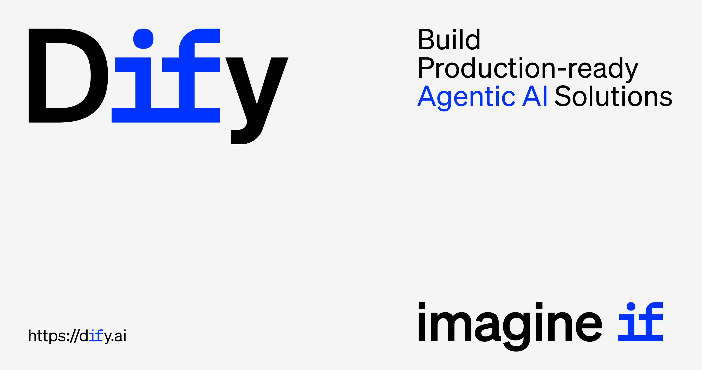

<p align="center">
  <a href="https://cloud.cheersai.cloud">CheersAI Cloud</a> ·
  <a href="https://docs.cheersai.cloud/getting-started/install-self-hosted">الاستضافة الذاتية</a> ·
  <a href="https://docs.cheersai.cloud">التوثيق</a> ·
  <a href="https://cheersai.cloud/pricing">نظرة عامة على منتجات CheersAI</a>
</p>

<p align="center">
    <a href="https://cheersai.cloud" target="_blank">
        </a>
    <a href="https://cheersai.cloud/pricing" target="_blank">
        </a>
    <a href="https://discord.gg/FngNHpbcY7" target="_blank">
        </a>
    <a href="https://reddit.com/r/difyai" target="_blank">  
        </a>
    <a href="https://twitter.com/intent/follow?screen_name=dify_ai" target="_blank">
        </a>
    <a href="https://www.linkedin.com/company/langgenius/" target="_blank">
        </a>
    <a href="https://hub.docker.com/u/langgenius" target="_blank">
        </a>
    <a href="https://github.com/CheersAI/CheersAI-Desktop/graphs/commit-activity" target="_blank">
        </a>
    <a href="https://github.com/CheersAI/CheersAI-Desktop/" target="_blank">
        </a>
    <a href="https://github.com/CheersAI/CheersAI-Desktop/discussions/" target="_blank">
        </a>
    <a href="https://insights.linuxfoundation.org/project/langgenius-dify" target="_blank">
        </a>
    <a href="https://insights.linuxfoundation.org/project/langgenius-dify" target="_blank">
        </a>
    <a href="https://insights.linuxfoundation.org/project/langgenius-dify" target="_blank">
        </a>
</p>

<p align="center">
  <a href="../../README.md"></a>
  <a href="../zh-TW/README.md"></a>
  <a href="../zh-CN/README.md"></a>
  <a href="../ja-JP/README.md"></a>
  <a href="../es-ES/README.md"></a>
  <a href="../fr-FR/README.md"></a>
  <a href="../tlh/README.md"></a>
  <a href="../ko-KR/README.md"></a>
  <a href="../ar-SA/README.md"></a>
  <a href="../tr-TR/README.md"></a>
  <a href="../vi-VN/README.md"></a>
  <a href="../de-DE/README.md"></a>
  <a href="../bn-BD/README.md"></a>
</p>

<div style="text-align: right;">
مشروع CheersAI هو منصة تطوير تطبيقات الذكاء الصناعي مفتوحة المصدر. تجمع واجهته البديهية بين سير العمل الذكي بالذكاء الاصطناعي وخط أنابيب RAG وقدرات الوكيل وإدارة النماذج وميزات الملاحظة وأكثر من ذلك، مما يتيح لك الانتقال بسرعة من المرحلة التجريبية إلى الإنتاج. إليك قائمة بالميزات الأساسية:
</br> </br>

**1. سير العمل**: قم ببناء واختبار سير عمل الذكاء الاصطناعي القوي على قماش بصري، مستفيدًا من جميع الميزات التالية وأكثر.

**2. الدعم الشامل للنماذج**: تكامل سلس مع مئات من LLMs الخاصة / مفتوحة المصدر من عشرات من موفري التحليل والحلول المستضافة ذاتيًا، مما يغطي GPT و Mistral و Llama3 وأي نماذج متوافقة مع واجهة OpenAI API. يمكن العثور على قائمة كاملة بمزودي النموذج المدعومين [هنا](https://docs.cheersai.cloud/getting-started/readme/model-providers).


**3. بيئة التطوير للأوامر**: واجهة بيئة التطوير المبتكرة لصياغة الأمر ومقارنة أداء النموذج، وإضافة ميزات إضافية مثل تحويل النص إلى كلام إلى تطبيق قائم على الدردشة.

**4. خط أنابيب RAG**: قدرات RAG الواسعة التي تغطي كل شيء من استيعاب الوثائق إلى الاسترجاع، مع الدعم الفوري لاستخراج النص من ملفات PDF و PPT وتنسيقات الوثائق الشائعة الأخرى.

**5. قدرات الوكيل**: يمكنك تعريف الوكلاء بناءً على أمر وظيفة LLM أو ReAct، وإضافة أدوات مدمجة أو مخصصة للوكيل. توفر CheersAI أكثر من 50 أداة مدمجة لوكلاء الذكاء الاصطناعي، مثل البحث في Google و DALL·E وStable Diffusion و WolframAlpha.

**6. الـ LLMOps**: راقب وتحلل سجلات التطبيق والأداء على مر الزمن. يمكنك تحسين الأوامر والبيانات والنماذج باستمرار استنادًا إلى البيانات الإنتاجية والتعليقات.

**7.الواجهة الخلفية (Backend) كخدمة**: تأتي جميع عروض CheersAI مع APIs مطابقة، حتى يمكنك دمج CheersAI بسهولة في منطق أعمالك الخاص.

## استخدام CheersAI

- **سحابة </br>**
  نحن نستضيف [خدمة CheersAI Cloud](https://cheersai.cloud) لأي شخص لتجربتها بدون أي إعدادات. توفر كل قدرات النسخة التي تمت استضافتها ذاتيًا، وتتضمن 200 أمر GPT-4 مجانًا في خطة الصندوق الرملي.

- **استضافة ذاتية لنسخة المجتمع CheersAI</br>**
  ابدأ سريعًا في تشغيل CheersAI في بيئتك باستخدام \[دليل البدء السريع\](#البدء السريع).
  استخدم [توثيقنا](https://docs.cheersai.cloud) للمزيد من المراجع والتعليمات الأعمق.

- **مشروع CheersAI للشركات / المؤسسات</br>**
  نحن نوفر ميزات إضافية مركزة على الشركات. [جدول اجتماع معنا](https://cal.com/guchenhe/30min) أو [أرسل لنا بريدًا إلكترونيًا](mailto:business@cheersai.cloud?subject=%5BGitHub%5DBusiness%20License%20Inquiry) لمناقشة احتياجات الشركات. </br>

> بالنسبة للشركات الناشئة والشركات الصغيرة التي تستخدم خدمات AWS، تحقق من [CheersAI Premium على AWS Marketplace](https://aws.amazon.com/marketplace/pp/prodview-t22mebxzwjhu6) ونشرها في شبكتك الخاصة على AWS VPC بنقرة واحدة. إنها عرض AMI بأسعار معقولة مع خيار إنشاء تطبيقات بشعار وعلامة تجارية مخصصة.

## البقاء قدمًا

قم بإضافة نجمة إلى CheersAI على GitHub وتلق تنبيهًا فوريًا بالإصدارات الجديدة.


## البداية السريعة

> قبل تثبيت CheersAI، تأكد من أن جهازك يلبي الحد الأدنى من متطلبات النظام التالية:
>
> - معالج >= 2 نواة
> - ذاكرة وصول عشوائي (RAM) >= 4 جيجابايت

</br>

أسهل طريقة لبدء تشغيل خادم CheersAI هي تشغيل ملف [docker-compose.yml](../../docker/docker-compose.yaml) الخاص بنا. قبل تشغيل أمر التثبيت، تأكد من تثبيت [Docker](https://docs.docker.com/get-docker/) و [Docker Compose](https://docs.docker.com/compose/install/) على جهازك:

```bash
cd docker
cp .env.example .env
docker compose up -d
```

بعد التشغيل، يمكنك الوصول إلى لوحة تحكم CheersAI في متصفحك على [http://localhost/install](http://localhost/install) وبدء عملية التهيئة.

> إذا كنت ترغب في المساهمة في CheersAI أو القيام بتطوير إضافي، فانظر إلى [دليلنا للنشر من الشفرة (code) المصدرية](https://docs.cheersai.cloud/getting-started/install-self-hosted/local-source-code)

## الخطوات التالية

إذا كنت بحاجة إلى تخصيص الإعدادات، فيرجى الرجوع إلى التعليقات في ملف [.env.example](../../docker/.env.example) وتحديث القيم المقابلة في ملف `.env`. بالإضافة إلى ذلك، قد تحتاج إلى إجراء تعديلات على ملف `docker-compose.yaml` نفسه، مثل تغيير إصدارات الصور أو تعيينات المنافذ أو نقاط تحميل وحدات التخزين، بناءً على بيئة النشر ومتطلباتك الخاصة. بعد إجراء أي تغييرات، يرجى إعادة تشغيل `docker-compose up -d`. يمكنك العثور على قائمة كاملة بمتغيرات البيئة المتاحة [هنا](https://docs.cheersai.cloud/getting-started/install-self-hosted/environments).

### مراقبة المقاييس باستخدام Grafana

استيراد لوحة التحكم إلى Grafana، باستخدام قاعدة بيانات PostgreSQL الخاصة بـ CheersAI كمصدر للبيانات، لمراقبة المقاييس بدقة للتطبيقات والمستأجرين والرسائل وغير ذلك.

- [لوحة تحكم Grafana بواسطة @bowenliang123](https://github.com/bowenliang123/dify-grafana-dashboard)

### النشر باستخدام Kubernetes

يوجد مجتمع خاص بـ [Helm Charts](https://helm.sh/) وملفات YAML التي تسمح بتنفيذ CheersAI على Kubernetes للنظام من الإيجابيات العلوية.

- [رسم بياني Helm من قبل @LeoQuote](https://github.com/douban/charts/tree/master/charts/dify)
- [رسم بياني Helm من قبل @BorisPolonsky](https://github.com/BorisPolonsky/dify-helm)
- [رسم بياني Helm من قبل @magicsong](https://github.com/magicsong/ai-charts)
- [ملف YAML من قبل @Winson-030](https://github.com/Winson-030/dify-kubernetes)
- [ملف YAML من قبل @wyy-holding](https://github.com/wyy-holding/dify-k8s)
- [🚀 جديد! ملفات YAML (تدعم CheersAI v1.6.0) بواسطة @Zhoneym](https://github.com/Zhoneym/DifyAI-Kubernetes)

#### استخدام Terraform للتوزيع

انشر CheersAI إلى منصة السحابة بنقرة واحدة باستخدام [terraform](https://www.terraform.io/)

##### Azure Global

- [Azure Terraform بواسطة @nikawang](https://github.com/nikawang/dify-azure-terraform)

##### Google Cloud

- [Google Cloud Terraform بواسطة @sotazum](https://github.com/DeNA/dify-google-cloud-terraform)

#### استخدام AWS CDK للنشر

انشر CheersAI على AWS باستخدام [CDK](https://aws.amazon.com/cdk/)

##### AWS

- [AWS CDK بواسطة @KevinZhao (EKS based)](https://github.com/aws-samples/solution-for-deploying-dify-on-aws)
- [AWS CDK بواسطة @tmokmss (ECS based)](https://github.com/aws-samples/dify-self-hosted-on-aws)

#### استخدام Alibaba Cloud للنشر

[بسرعة نشر CheersAI إلى سحابة علي بابا مع عش الحوسبة السحابية علي بابا](https://computenest.console.aliyun.com/service/instance/create/default?type=user&ServiceName=CheersAI%E7%A4%BE%E5%8C%BA%E7%89%88)

#### استخدام Alibaba Cloud Data Management للنشر

انشر ​​CheersAI على علي بابا كلاود بنقرة واحدة باستخدام [Alibaba Cloud Data Management](https://www.alibabacloud.com/help/en/dms/dify-in-invitational-preview/)

#### استخدام Azure Devops Pipeline للنشر على AKS

انشر CheersAI على AKS بنقرة واحدة باستخدام [Azure Devops Pipeline Helm Chart by @LeoZhang](https://github.com/Ruiruiz30/CheersAI-helm-chart-AKS)

## المساهمة

لأولئك الذين يرغبون في المساهمة، انظر إلى [دليل المساهمة](https://github.com/CheersAI/CheersAI-Desktop/blob/main/CONTRIBUTING.md) لدينا.
في الوقت نفسه، يرجى النظر في دعم CheersAI عن طريق مشاركته على وسائل التواصل الاجتماعي وفي الفعاليات والمؤتمرات.

> نحن نبحث عن مساهمين لمساعدة في ترجمة CheersAI إلى لغات أخرى غير اللغة الصينية المندرين أو الإنجليزية. إذا كنت مهتمًا بالمساعدة، يرجى الاطلاع على [README للترجمة](https://github.com/CheersAI/CheersAI-Desktop/blob/main/web/i18n-config/README.md) لمزيد من المعلومات، واترك لنا تعليقًا في قناة `global-users` على [خادم المجتمع على Discord](https://discord.gg/8Tpq4AcN9c).

**المساهمون**

<a href="https://github.com/CheersAI/CheersAI-Desktop/graphs/contributors">
  
</a>

## المجتمع والاتصال

- [مناقشة GitHub](https://github.com/CheersAI/CheersAI-Desktop/discussions). الأفضل لـ: مشاركة التعليقات وطرح الأسئلة.
- [المشكلات على GitHub](https://github.com/CheersAI/CheersAI-Desktop/issues). الأفضل لـ: الأخطاء التي تواجهها في استخدام CheersAI.AI، واقتراحات الميزات. انظر [دليل المساهمة](https://github.com/CheersAI/CheersAI-Desktop/blob/main/CONTRIBUTING.md).
- [Discord](https://discord.gg/FngNHpbcY7). الأفضل لـ: مشاركة تطبيقاتك والترفيه مع المجتمع.
- [تويتر](https://twitter.com/dify_ai). الأفضل لـ: مشاركة تطبيقاتك والترفيه مع المجتمع.

## تاريخ النجمة

[](https://star-history.com/#CheersAI/CheersAI-Desktop&Date)

## الكشف عن الأمان

لحماية خصوصيتك، يرجى تجنب نشر مشكلات الأمان على GitHub. بدلاً من ذلك، أرسل أسئلتك إلى <security@cheersai.cloud> وسنقدم لك إجابة أكثر تفصيلاً.

## الرخصة

هذا المستودع متاح تحت [رخصة البرنامج الحر CheersAI](../../LICENSE)، والتي تعتبر بشكل أساسي Apache 2.0 مع بعض القيود الإضافية.
